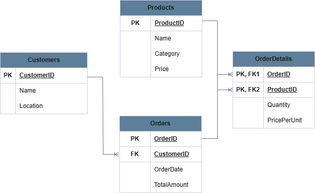

# E-Commerce-Sales-Analysis 

SQL-based analysis of an e-commerce dataset to uncover insights across customer behavior, product performance, sales trends, and inventory efficiency, enabling data-driven business decisions.

## 🎯 Project Objective
To analyze e-commerce data using SQL and generate actionable insights for improving customer engagement, optimizing product strategy, enhancing sales performance, and managing inventory effectively.

## Database Schema

### 🧩 Schema Overview
- **Customers** (cust_id, name, location)
- **Orders** (order_id, customer_id, order_date, total_amount)
- **OrderDetails** (order_id, product_id, quantity, price_per_unit)
- **Products** (product_id, name, category, price)

### 🔗 Entity Relationships
- **Customers → Orders:** One-to-Many (A customer can place multiple orders)
- **Orders → OrderDetails:** One-to-Many (Each order can have multiple products)
- **Products → OrderDetails:** One-to-Many (A product can appear in multiple orders)

## ER Diagram

## ❓ Questions
- Which are the top cities with the highest customer base?
- How are customers distributed based on purchase frequency (one-time vs repeat)?
- Which products generate high revenue despite lower purchase quantities?
- What is the customer reach across different product categories?
- How are sales and average order value (AOV) changing month-on-month?
- Which products have the highest turnover rates?
- Which products have low customer engagement?
- What are the trends in customer acquisition over time?

## ⚙️ Process
- Queried and analyzed data from **Customers, Orders, Products, and OrderDetails tables** using SQL.
- Performed **customer segmentation** based on order frequency using CASE statements.
- Used **aggregations and joins** to evaluate category performance and customer reach.
- Applied **CTEs and window functions (LAG)** to calculate MoM sales growth and AOV changes.
- Identified **high-value and low-engagement products** using filtering and conditional logic.
- Analyzed product demand and inventory efficiency through sales frequency metrics.
- Evaluated customer acquisition trends using first purchase date analysis.

## 💻 SQL Queries
You can find all SQL queries used in this analysis here:  
👉 [View SQL File](./sql/e-commerce_analysis.sql)

## 🔍 Project Insights
- Identified **top 3 cities contributing the highest customer base**, enabling targeted marketing strategies.
- Majority of **customers were one-time or occasional buyers**, indicating scope for improving retention.
- Certain products generated **2–3x higher revenue despite low average quantities**, highlighting high-value items.
- Found **top-performing categories with high customer reach**, while others showed limited engagement.
- Observed **fluctuations in MoM sales and AOV**, indicating changing purchasing patterns.
- Identified **fast-moving products requiring frequent restocking**, improving inventory planning.
- Detected **low-engagement products (<40% customer reach)**, suggesting optimization opportunities.
- Customer acquisition trends revealed **periods of growth and slowdown**, aiding marketing strategy alignment.

## ✅ Final Conclusion
This analysis demonstrates how SQL can be effectively used to extract meaningful insights from raw e-commerce data. By identifying customer behavior patterns, product performance trends, and inventory dynamics, the project enables businesses to make informed decisions on marketing, pricing, and operations, ultimately driving growth and efficiency.
